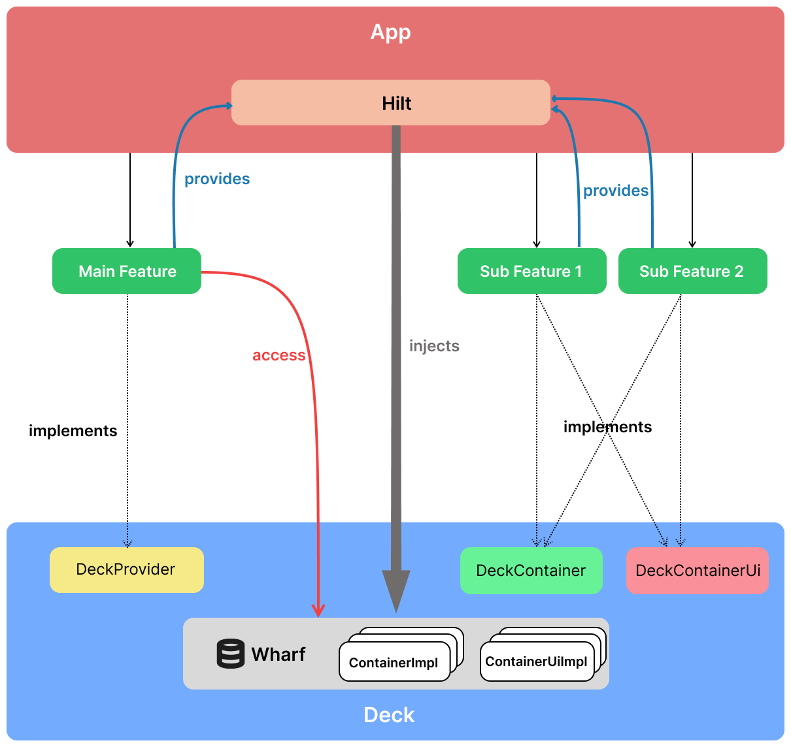

Deck
=====

[](https://github.com/naturecurly/deck/actions/workflows/build.yml)
[](https://central.sonatype.com/artifact/com.naturecurly.deck/deck-compose)

Deck is a pluggable UI framework for Android Jetpack Compose. It addresses the common challenge of integrating multiple sub-functionalities into a primary feature without creating direct dependencies.

_Note: This framework requires use of [KSP](https://github.com/google/ksp) and [Hilt](https://github.com/google/dagger) in your project_

What is the problem?
--------
In large-scale modular projects, directly coupling the main feature module with multiple child modules creates tight dependencies. This approach results in challenges such as:

- **Scalability Issues**: Adding or modifying child modules requires changes in the main module.
- **Codebase Maintenance**: Increased complexity makes refactoring and updates harder.
- **Build Time**: Direct dependencies between modules can lead to longer build times, especially in large projects.
- **Testability**: High coupling complicates unit and integration testing.

Why Deck?
--------
This library addresses these issues by enabling a decoupled architecture, where the main module remains agnostic of specific child modules.
- **Decoupled Architecture**
    - The main module only interacts with abstract interfaces or contracts. Child modules implement these interfaces and inject their UI at runtime.
- **Improved Scalability**
    - Adding or removing a child module only requires minimal changes in the main module. The framework dynamically discovers and integrates available child modules.
- **Reduced Build Time**
    - Since the main module doesn’t directly depend on child modules, changes in one child module don’t trigger a rebuild of the main module.
- **Simplified Testing**
    - The main module can be tested independently of child modules. Mock implementations can be used for child module contracts.
- **Better Team Collaboration**
    - Teams working on different modules can work in isolation, minimizing merge conflicts and dependencies.

How It Works
--------
- Define Contracts
    - The main module implements Deck's contracts(Provider) that describe the main feature behavior.
- Implement Contracts in Child Modules
    - Each child module implements Deck's contracts(Container and ContainerUi) and registers itself using `Hilt`(IoC).
- Runtime Injection
    - At runtime, the library dynamically discovers child modules and injects their UI into the main module based on the contracts. The main module can then inject child modules' UI at any place.



Getting Started
--------

Download [the latest JAR](https://repo1.maven.org/maven2/com/naturecurly/deck/deck-compose/0.1.0/deck-compose-0.1.0.aar) or depend via Gradle:
```kotlin
implementation("com.naturecurly.deck:deck-compose:0.6.0")
ksp("com.naturecurly.deck:deck-codegen:0.6.0")
```

Usage
--------
### Primary Feature
1. Make the ViewModel or Presenter of the primary feature inherit from DeckProvider. Specify the generic type for the type that the subfeatures will consume. For example, the `MainViewModel` below exposes a `String` to subfeatures:
```kotlin
class MainViewModel @Inject constructor() : ViewModel(), DeckProvider<String> { // Extends the DeckProvider
    // ViewModel logic here
}
```
2. Mark the class (e.g., ViewModel, Presenter) with the @Provider annotation. The annotation parameter should be the ID of the main feature, allowing subfeatures to bind to the primary feature. For example, when the id is `MainFeature`:
```kotlin
@Provider("MainFeature")
class MainViewModel @Inject constructor() : ViewModel(), DeckProvider<String> {
    // ViewModel logic here
}
```
3. Call DeckProvider's lifecycle functions at the appropriate time
```kotlin
@Provider("MainFeature")
class MainViewModel @Inject constructor() : ViewModel(), DeckProvider<String> {
    init {
        initDeckProvider(viewModelScope) // Call DeckProvider's init function
        onDeckReady(viewModelScope, "Hello, World!") // Call when the output data is ready
    }

    override fun onCleared() {
        super.onCleared()
        onDeckClear() // Call when the primary feature is destroyed
    }
}
```
### Subfeatures
1. Create a Container for the primary feature and extend the `DeckContainer`. The `String` is the input type from the DeckProvider(MainViewModel), and the `FeatureOneModel` is the output that will be consumed by UI:
```kotlin
// Note: Please add @Inject constructor to your container to enable Hilt to inject automatically
class FeatureOneContainer @Inject constructor() : DeckContainer<String, FeatureOneModel>() { ... }
```
2. Mark the class with the @Container annotation, and the annotation parameter should be the primary feature's id which was defined above:
```kotlin
@Container(bindTo = "MainFeature")
class FeatureOneContainer @Inject constructor() : DeckContainer<String, FeatureOneModel>() { ... }
```
3. Implement the functions in the DeckContainer. The `uiStateFlow` can be listened to in your UI code later and the `onEvent()` is to handle events from UI:
```kotlin
@Container(bindTo = "MainFeature")
class FeatureOneContainer @Inject constructor() : DeckContainer<String, FeatureOneModel>() {
    override fun init(scope: CoroutineScope) {
        ...
    }

    override fun onDataReady(scope: CoroutineScope, data: String) {
        _uiStateFlow.value = FeatureTwoModel(title = "Feature One", subtitle = data)
    }

    private val _uiStateFlow = MutableStateFlow<FeatureTwoModel>(FeatureOneModel())

    override val uiStateFlow: StateFlow<FeatureOneModel> = _uiStateFlow

    override fun onEvent(event: Any) {
        ...
    }
}
```
4. Create a ContainerUi for UI which will be injected into the primary feature. The containerUi is marked with @ContainerUi, and it extends the `DeckComposeContainerUi`. The `FeatureOneModel` is the input type, and the `FeatureOneContainer` is the UI data source.
```kotlin
@ContainerUi(bindTo = "MainFeature")
class FeatureOneContainerUi @Inject constructor() :DeckComposeContainerUi<FeatureOneModel, FeatureOneContainer>() {
    // UI content
    @Composable
    override fun Content(modifier: Modifier) {
        val state by container.uiStateFlow.collectAsStateWithLifecycle()
        Column(modifier) {
            Text(state.title)
            Text(state.subtitle)
        }
    }
    // ID of the UI, and it will used to locate the container ui in the primary feature's UI
    override val id: String = "FeatureOne"
}
```
### Inject Subfeatures' UI to the Primary Feature UI
Call `Deck(provider: DeckProvider) {}` in your primary feature's composable code, and in the block, you can add any composable code. In the DeckScope, `Stub(containerUiId: String)` is used to inject the target subfeature's containerUi
```kotlin
@Composable
fun MainScreen(viewModel: MainViewModel = viewModel()) {
    Scaffold(modifier = Modifier.fillMaxSize()) {
          Deck(viewModel) {
              Column {
                  ...
                  Stub("FeatureOne")
                  ...
              }
          }
      }
}
```

License
---------

```
Copyright (c) 2025 naturecurly

Permission is hereby granted, free of charge, to any person obtaining a copy
of this software and associated documentation files (the "Software"), to deal
in the Software without restriction, including without limitation the rights
to use, copy, modify, merge, publish, distribute, sublicense, and/or sell
copies of the Software, and to permit persons to whom the Software is
furnished to do so, subject to the following conditions:

The above copyright notice and this permission notice shall be included in all
copies or substantial portions of the Software.

THE SOFTWARE IS PROVIDED "AS IS", WITHOUT WARRANTY OF ANY KIND, EXPRESS OR
IMPLIED, INCLUDING BUT NOT LIMITED TO THE WARRANTIES OF MERCHANTABILITY,
FITNESS FOR A PARTICULAR PURPOSE AND NONINFRINGEMENT. IN NO EVENT SHALL THE
AUTHORS OR COPYRIGHT HOLDERS BE LIABLE FOR ANY CLAIM, DAMAGES OR OTHER
LIABILITY, WHETHER IN AN ACTION OF CONTRACT, TORT OR OTHERWISE, ARISING FROM,
OUT OF OR IN CONNECTION WITH THE SOFTWARE OR THE USE OR OTHER DEALINGS IN THE
SOFTWARE.

```
